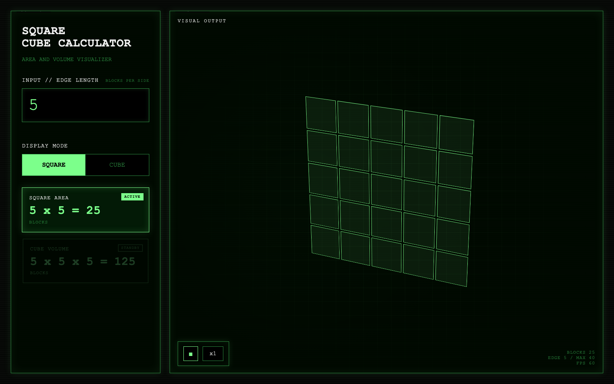

# Square Cube Calculator

**Version:** v1.0  
**Concept:** A NASA-style square and cube visualization simulator for children around age 5.

This is a pure HTML, CSS, and JavaScript learning tool that helps children see how a square grows into area and how a cube grows into volume. The interface uses a spacecraft instrument-panel style: high-contrast terminal typography, green display lines, measurement guides, rotation controls, and live visual feedback.

## Screenshot

## Features

- Visualizes square area as `edge x edge`.
- Visualizes cube volume as `edge x edge x edge`.
- Shows a large animated 2D square grid and 3D cube.
- Highlights the active calculation mode: `SQUARE AREA` or `CUBE VOLUME`.
- Includes cube edge measurement guides so children can feel the meaning of edge length.
- Supports mouse and touch drag rotation for the 3D object.
- Automatically resumes rotation after interaction.
- Provides play/pause and speed cycle controls.
- Provides keyboard shortcuts for fast control.
- Shows FPS and block count readouts.
- Saves normal settings in local storage.
- Runs without any external library or build step.

## How To Use

1. Open `index.html` in a browser.
2. Enter an edge length.
3. Choose `SQUARE` or `CUBE`.
4. Watch the visual output and compare the total block count.

## Keyboard Shortcuts

- `Arrow Up` / `Arrow Down`: Increase or decrease edge length.
- `Arrow Right` / `Arrow Left`: Increase or decrease rotation speed.
- `Space`: Play or stop rotation.
- `T`: Toggle display mode.

## Files

- `index.html`: App structure.
- `styles.css`: NASA-style instrument panel design and visual rendering styles.
- `script.js`: Calculator logic, rendering, animation, input limits, local storage, and controls.

## Intended Audience

This tool is designed for young children who are beginning to understand shape, size, counting, square area, and cube volume. The goal is not to teach formulas first, but to let children see the structure before naming the math.

---

# 정사각형 큐브 계산기

**버전:** v1.0  
**콘셉트:** 5세 전후 어린이를 위한 NASA 스타일 정사각형과 큐브 시각화 시뮬레이터.

이 앱은 HTML, CSS, JavaScript만으로 만든 학습 도구입니다. 아이가 정사각형의 넓이가 어떻게 커지는지, 정육면체의 부피가 어떻게 커지는지를 눈으로 볼 수 있게 합니다. 화면은 우주선 계기판 느낌의 디자인을 사용하며, 터미널 폰트, 초록색 계측선, 회전 조작, 실시간 숫자 표시를 제공합니다.

## 스크린샷

## 주요 기능

- 정사각형 넓이를 `한 변 x 한 변`으로 보여줍니다.
- 정육면체 부피를 `한 변 x 한 변 x 한 변`으로 보여줍니다.
- 2D 정사각형 격자와 3D 큐브를 크게 시각화합니다.
- 현재 선택한 모드에 따라 `SQUARE AREA` 또는 `CUBE VOLUME` 카드를 강조합니다.
- 큐브 한 변의 길이를 계측선으로 보여줘서 길이 변화를 직관적으로 느낄 수 있습니다.
- 마우스와 터치로 3D 물체를 직접 회전할 수 있습니다.
- 조작이 끝나면 자동 회전이 다시 시작됩니다.
- 재생/정지 버튼과 회전 속도 순환 버튼을 제공합니다.
- 빠른 조작을 위한 키보드 단축키를 제공합니다.
- FPS와 블록 개수를 화면에 표시합니다.
- 일반 새로고침 후에도 설정을 로컬 스토리지에 저장합니다.
- 외부 라이브러리나 빌드 과정 없이 바로 실행됩니다.

## 사용 방법

1. 브라우저에서 `index.html`을 엽니다.
2. 한 변의 블록 개수를 입력합니다.
3. `SQUARE` 또는 `CUBE`를 선택합니다.
4. 화면의 모양과 전체 블록 개수를 비교합니다.

## 키보드 단축키

- `Arrow Up` / `Arrow Down`: 한 변의 길이를 늘리거나 줄입니다.
- `Arrow Right` / `Arrow Left`: 회전 속도를 높이거나 낮춥니다.
- `Space`: 회전을 재생하거나 정지합니다.
- `T`: 디스플레이 모드를 전환합니다.

## 파일 구성

- `index.html`: 앱의 기본 구조.
- `styles.css`: NASA 스타일 계기판 디자인과 시각화 스타일.
- `script.js`: 계산 로직, 렌더링, 애니메이션, 입력 제한, 로컬 저장, 조작 기능.

## 대상

이 도구는 모양, 크기, 개수 세기, 정사각형 넓이, 정육면체 부피를 처음 접하는 어린이를 위해 만들었습니다. 목표는 공식을 먼저 외우게 하는 것이 아니라, 구조를 눈으로 이해한 뒤 수학적 이름을 붙일 수 있게 돕는 것입니다.
